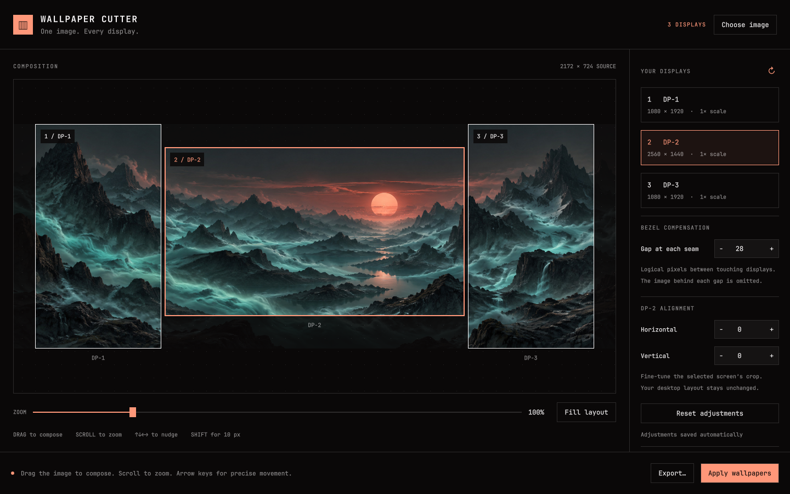

# Wallpaper Cutter



[](LICENSE)
[](manifest.json)


Compose one image across your Omarchy displays. A native Quickshell editor
with live crop previews, bezel compensation, and a wallpaper for each screen.
No bar widget, tray icon, browser, or web server.

Inspired by [wallpaper-cutter](https://github.com/renantonheiro/wallpaper-cutter).

## What it does

- **Detect your layout.** Portrait screens, fractional scaling, and negative positions included.
- **Compose live.** Drag the image, click or drag the zoom bar, and nudge with the keyboard.
- **Hide the seams.** Add bezel spacing and fine-tune each display's alignment.
- **Remember your setup.** Bezel and alignment changes save automatically, without exporting.
- **Save and reuse cuts.** Name exports and import them later with the image and adjustments included.
- **Make it your desktop.** Export native-resolution PNGs or apply them to every screen.
- **Match your theme.** Native dialogs use your system settings; changing themes restores Omarchy’s background.

## Install and open

On Omarchy Quattro, install and enable the plugin:

```bash
omarchy plugin add https://github.com/renanmt/omarchy-wallpaper-cutter --enable
```

Open **Installed Apps** and search for **Wallpaper Cutter**.

That is all the setup: the plugin automatically registers its app launcher and
Omarchy theme-change hook. Standard Omarchy installations already include
Quickshell, Python 3, and ImageMagick. No extra packages, installer scripts,
manual file copies, or custom keybindings are required.

The [marketplace listing](https://plugins.omarchy.org/plugin.html?id=renan.wallpaper-cutter)
provides the standard installation command too. No bar widget or tray icon is
added. Closing the editor keeps applied wallpapers active.

## Compose

1. Choose a local image. PNG, JPEG, WebP, BMP, and TIFF are supported.
2. The editor reads active independent displays from `hyprctl monitors -j`.
   Use ↻ after changing the monitor layout.
3. Drag the image, scroll or use the slider to zoom, and use arrow keys to
   nudge by one logical pixel (Shift: ten). **Fill layout** recenters and covers
   the full layout. Ctrl+O chooses an image; Escape closes the editor.
4. Set **Gap at each seam** to account for the combined physical bezel between
   touching displays. Select a display to adjust its crop horizontally or
   vertically. These controls never change the actual Hyprland monitor layout.
5. **Export…** opens the native Save dialog with `cut-<image name>` prefilled.
   Edit the name and choose the destination in that same dialog. The selected
   name becomes the export folder. Existing names receive a numeric suffix,
   so earlier cuts are never
   overwritten. Each export includes PNGs, `layout.json`, and a copy of the
   source image for portable imports. **Apply wallpapers** exports and activates
   the per-screen
   renderer. Uncovered displays block both actions to prevent accidental black
   edges. The faint image outside the monitor frames is excluded from export.

**Import cut…** opens an exported `layout.json`. It restores the source image,
zoom, position, bezel compensation, and individual monitor offsets on your
current display layout. Review the preview before applying. Earlier exports
without a bundled source image can still be imported if the original exists.

Gap and alignment values use Hyprland **logical pixels**, not source pixels or
millimeters. Rotation swaps output dimensions; export restores each display's
native pixel resolution independently of its scale. Existing gaps and negative
positions are preserved. Mirrored outputs are excluded. Bezel gaps propagate
across touching horizontal/vertical chains; unusual arrangements can be tuned
with the per-display offsets. Screens with different physical pixel densities
may need further alignment; this version does not infer physical dimensions.

### Your adjustments are remembered

Bezel compensation and per-display X/Y alignment are saved **as you change
them**, even before choosing an image or exporting. The user file is:

```text
~/.config/omarchy-wallpaper-cutter/settings.json
```

`$XDG_CONFIG_HOME` is respected when set. Writes are atomic, and display offsets
are keyed by output name so disconnected screens retain their calibration.
**Reset adjustments** saves the reset too. Existing export-based settings are
migrated the first time this file is created.

```json
{
  "version": 1,
  "gap": 32,
  "adjustments": {
    "DP-1": { "x": -12, "y": 8 }
  }
}
```

Quit the standalone app or disable the installed plugin before editing this
file manually, then reopen/re-enable it. The last exported image composition
is restored separately; it never overwrites newer alignment settings.

## Wallpaper behavior and storage

The service draws one click-through bottom-layer surface per configured
output, above Omarchy's stock background and below normal application windows.
It does not kill, disable, or modify the stock background renderer. Desktop
clicks pass through to Omarchy. **Restore Omarchy wallpaper** clears the active
mapping immediately (poll fallback: 1.5 seconds). Disabling the plugin also
removes its surfaces.

Changing the Omarchy theme automatically clears the per-screen wallpaper
overrides, revealing the new theme's background. The plugin registers its own
`~/.config/omarchy/hooks/theme-set.d/renan.wallpaper-cutter` hook when enabled
and removes its managed hook when disabled. It preserves other hooks, saved
exports, the last composition, and calibration settings. If a theme changes
during an export, the PNGs are saved but the new theme wallpaper takes priority.
Closing the editor leaves applied images active until restored or a theme changes.
Disconnecting a monitor removes its
surface; reconnecting the same output restores the stored image. If output
resolution or rotation changes, refresh the layout and apply a new cut.

State lives under `$XDG_STATE_HOME/omarchy-wallpaper-cutter`, falling back to
`~/.local/state/omarchy-wallpaper-cutter`:

- `applied.json`: output-name → exported PNG mapping, atomically replaced.
- `session.json`: last successful composition.
- `exports/cut-…/`: PNGs, the source image, and a reproducible `layout.json` for each apply.
- `preview-….jpg`: EXIF-normalized preview images (up to 3840 px).

Exports are 8-bit RGB PNGs. Images are EXIF-oriented and converted to sRGB;
transparent areas are flattened onto black. Animated/multi-page files use the
first frame. HDR workflows and image rotation controls are not supported yet.
Old exports and preview files are retained;
you may remove unused ones manually after restoring the stock wallpaper.
No image is uploaded. The Python helper invokes ImageMagick for image processing, and
commands are passed as argument arrays without shell interpolation.

## Remove

```bash
omarchy plugin remove renan.wallpaper-cutter
```

Disabling or removing the plugin removes its wallpaper surfaces, automatically
managed launcher entry, and theme hook. Your saved settings and exported images
remain. Customized launcher/hook files are preserved.

For a **development installation made with `bin/install-local`**, disable the
plugin and remove its symlink instead:

```bash
omarchy plugin disable renan.wallpaper-cutter
unlink ~/.config/omarchy/plugins/renan.wallpaper-cutter
omarchy-shell shell rescanPlugins
```

The development checkout remains intact.

## Validate

```bash
omarchy plugin validate .
python3 -S -m unittest discover -s tests -v
node tests/test_geometry.cjs
QT_QPA_PLATFORM=offscreen QT_QUICK_BACKEND=software /usr/lib/qt6/bin/qmltestrunner -input tests
```

Backend tests cover rotation, fractional scale, negative coordinates, EXIF,
output dimensions, discarded bezel pixels, invalid crops, unique exports, and
preserving the applied mapping on failure. Settings tests cover persistence
without export, migration, reset, and invalid input. The Qt test performs real
mouse clicks and drags on the zoom slider. Geometry tests cover horizontal
and vertical chains, individual offsets, corner-only contact, and existing gaps.

For the native diagnostic-rendering regression check (requires a running
Wayland session), run `python3 tests/check_plaintext_ui.py`. It opens isolated
editor windows and uses a loopback-only HTTP server to verify that markup in
error messages cannot load an embedded image. An AutoText copy is the positive
control; the real editor must render plain text and make zero image requests.

Run `python tests/check_desktop_ui.py` in a Wayland session to check installed-app
registration across service reloads and theme-hook removal of wallpaper overrides. Run `python tests/check_picker_ui.py` to check
native image selection, named export, cancellation, unexpected picker exit, and
closing the editor while a picker is open. `python tests/check_export_import_ui.py`
checks the named-export/import round trip. Checks use temporary user directories.

Image selection, import, and named export use system file dialogs to follow the
desktop theme and interaction conventions. The picker runs in a separate,
short-lived Quickshell process so a native-dialog failure cannot terminate
the desktop shell. Closing the editor also stops its picker.

## Development

### Development checkout (optional)

Requires Omarchy Quattro with its plugin-capable shell, Quickshell, Python 3,
and ImageMagick (`magick`). These runtime tools come with standard Omarchy
installations; no pip packages or extra image-library installation is needed.
Node and Qt Test are only used for development tests.

```bash
# Development preview, without installing the plugin:
./bin/wallpaper-cutter --standalone
```

Closing the standalone window exits its process after pending work finishes.
Its wallpaper renderer also stops, revealing the normal Omarchy background.
For normal use, install into the Omarchy shell so wallpapers survive closing
the editor and return at login:

```bash
./bin/install-local
./bin/wallpaper-cutter
```

The local installer links this checkout into the user's plugin directory and
enables it. The service then registers **Wallpaper Cutter** in the app launcher. It does
not add anything to the bar. Keep the checkout at its installed location.
Alternatively, summon an installed plugin directly:

```bash
omarchy-shell shell summon renan.wallpaper-cutter '{}'
```

Keep dialogs native and inherit the desktop configuration. Do not force GTK/Qt
theme overrides or substitute Qt Quick fallback pickers. UI tests isolate app
settings and exports while passing the real desktop configuration to picker
processes, so their appearance remains faithful to the active Omarchy theme.

When testing updates to an already running installation, a plugin rescan may
retain previously loaded QML. If behavior still matches the old code, run
`omarchy restart shell`, then reopen Wallpaper Cutter from Installed Apps.
This briefly restarts the bar and plugin services. Verify the installed
launch path as well as the isolated UI tests: opening a picker should log
`Wallpaper Cutter native picker PID:` with a different process ID from
the desktop shell.

The UI is QML, crop geometry is JavaScript, and image processing uses Python
and the system ImageMagick command. The installed plugin uses Omarchy's v1 `panel` and `service`
contracts. No network service is started and no image is uploaded.

| File | Purpose |
| --- | --- |
| `Picker.qml` | Native system dialogs isolated from the desktop shell |
| `Panel.qml` | Editor, settings persistence, and helper coordination |
| `ZoomSlider.qml` | Mouse- and keyboard-accessible zoom control |
| `Geometry.js` | Monitor layout and bezel spacing |
| `backend.py` | Discovery, settings, previews, and PNG exports |
| `WallpaperService.qml` | Per-output wallpaper surfaces |
| `Theme.qml` | Live Omarchy palette |
| `launcher.py` | Installed-app entry and theme hook with reload-safe cleanup |

For publishing requirements, see the [Omarchy marketplace guide](https://plugins.omarchy.org/publish.html).

## License

[MIT](LICENSE) © Renan Tonheiro. The screenshot shows the real editor using an original AI-generated demo
wallpaper. See [preview asset notes](docs/preview-assets.md) for the prompt and
reproduction details. Project preview assets are included under the same license.
