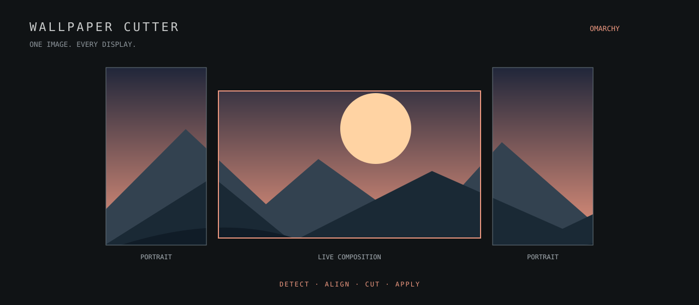

# Wallpaper Cutter



[](LICENSE)
[](manifest.json)


Compose one image across your Omarchy displays. A native Quickshell editor
with live crop previews, bezel compensation, and a wallpaper for each screen.
No bar widget, tray icon, browser, or web server.

Inspired by [wallpaper-cutter](https://github.com/renantonheiro/wallpaper-cutter).

## What it does

- **Detect your layout.** Portrait screens, fractional scaling, and negative positions included.
- **Compose live.** Drag the image, click or drag the zoom bar, and nudge with the keyboard.
- **Hide the seams.** Add bezel spacing and fine-tune each display's alignment.
- **Remember your setup.** Bezel and alignment changes save automatically, without exporting.
- **Make it your desktop.** Export native-resolution PNGs or apply them to every screen.
- **Match your theme.** Colors follow the current Omarchy palette.

## Install

```bash
omarchy pkg add python-pillow
omarchy plugin add https://github.com/renanmt/omarchy-wallpaper-cutter --enable
omarchy-shell shell summon renan.wallpaper-cutter '{}'
```

To add **Wallpaper Cutter** to your application launcher:

```bash
mkdir -p ~/.local/share/applications
cp ~/.config/omarchy/plugins/renan.wallpaper-cutter/renan.wallpaper-cutter.desktop ~/.local/share/applications/
```

There is no bar widget or tray icon. The installed editor runs inside the
Omarchy shell; its wallpaper service remains active when you close the window.

## Run locally

Requires Omarchy Quattro with its plugin-capable shell, Quickshell, Python 3,
and Pillow (`python-pillow` on Arch). Node is only used for geometry tests.

```bash
# If Pillow is missing:
omarchy pkg add python-pillow

# Development preview, without installing the plugin:
./bin/wallpaper-cutter --standalone
```

Closing the standalone window exits its process after pending work finishes.
Its wallpaper renderer also stops, revealing the normal Omarchy background.
For normal use, install into the Omarchy shell so wallpapers survive closing
the editor and return at login:

```bash
./bin/install-local
./bin/wallpaper-cutter
```

The local installer links this checkout into the user's plugin directory,
enables it, and adds **Wallpaper Cutter** to the application launcher. It does
not add anything to the bar. Keep the checkout at its installed location.
Alternatively, summon an installed plugin directly:

```bash
omarchy-shell shell summon renan.wallpaper-cutter '{}'
```

## Compose

1. Choose a local image. PNG, JPEG, WebP, BMP, and TIFF are supported.
2. The editor reads active independent displays from `hyprctl monitors -j`.
   Use ↻ after changing the monitor layout.
3. Drag the image, scroll or use the slider to zoom, and use arrow keys to
   nudge by one logical pixel (Shift: ten). **Fill layout** recenters and covers
   the full layout. Ctrl+O chooses an image; Escape closes the editor.
4. Set **Gap at each seam** to account for the combined physical bezel between
   touching displays. Select a display to adjust its crop horizontally or
   vertically. These controls never change the actual Hyprland monitor layout.
5. **Export…** writes native-resolution PNGs into a new directory below the
   chosen folder. **Apply wallpapers** exports and activates the per-screen
   renderer. Uncovered displays block both actions to prevent accidental black
   edges. The faint image outside the monitor frames is excluded from export.

Gap and alignment values use Hyprland **logical pixels**, not source pixels or
millimeters. Rotation swaps output dimensions; export restores each display's
native pixel resolution independently of its scale. Existing gaps and negative
positions are preserved. Mirrored outputs are excluded. Bezel gaps propagate
across touching horizontal/vertical chains; unusual arrangements can be tuned
with the per-display offsets. Screens with different physical pixel densities
may need further alignment; this version does not infer physical dimensions.

### Your adjustments are remembered

Bezel compensation and per-display X/Y alignment are saved **as you change
them**, even before choosing an image or exporting. The user file is:

```text
~/.config/omarchy-wallpaper-cutter/settings.json
```

`$XDG_CONFIG_HOME` is respected when set. Writes are atomic, and display offsets
are keyed by output name so disconnected screens retain their calibration.
**Reset adjustments** saves the reset too. Existing export-based settings are
migrated the first time this file is created.

```json
{
  "version": 1,
  "gap": 32,
  "adjustments": {
    "DP-1": { "x": -12, "y": 8 }
  }
}
```

Quit the standalone app or disable the installed plugin before editing this
file manually, then reopen/re-enable it. The last exported image composition
is restored separately; it never overwrites newer alignment settings.

## Wallpaper behavior and storage

The service draws one click-through bottom-layer surface per configured
output, above Omarchy's stock background and below normal application windows.
It does not kill, disable, or modify the stock background renderer. Desktop
clicks pass through to Omarchy. **Restore Omarchy wallpaper** clears the active
mapping immediately (poll fallback: 1.5 seconds). Disabling the plugin also
removes its surfaces.

While applied, the plugin's images remain above stock wallpaper/theme changes;
restore Omarchy's wallpaper to show those changes. Closing the editor leaves
applied images active when installed. Disconnecting a monitor removes its
surface; reconnecting the same output restores the stored image. If output
resolution or rotation changes, refresh the layout and apply a new cut.

State lives under `$XDG_STATE_HOME/omarchy-wallpaper-cutter`, falling back to
`~/.local/state/omarchy-wallpaper-cutter`:

- `applied.json`: output-name → exported PNG mapping, atomically replaced.
- `session.json`: last successful composition.
- `exports/cut-…/`: PNGs and a reproducible `layout.json` for each apply.
- `preview-….jpg`: EXIF-normalized preview images (up to 3840 px).

Exports are RGB PNGs; embedded color profiles/HDR workflows and image rotation
controls are not supported yet. Old exports and preview files are retained;
you may remove unused ones manually after restoring the stock wallpaper.
No image is uploaded. Only the Python helper reads/writes image files, and
commands are passed as argument arrays without shell interpolation.

## Remove a local installation

Disable the plugin first, then remove only its link and launcher entry:

```bash
omarchy plugin disable renan.wallpaper-cutter
unlink ~/.config/omarchy/plugins/renan.wallpaper-cutter
rm ~/.local/share/applications/renan.wallpaper-cutter.desktop
omarchy-shell shell rescanPlugins
```

The checkout and exported images remain intact. A git-installed copy can be
removed with `omarchy plugin remove renan.wallpaper-cutter` instead.

## Validate

```bash
omarchy plugin validate .
python3 -m unittest discover -s tests -v
node tests/test_geometry.cjs
QT_QPA_PLATFORM=offscreen QT_QUICK_BACKEND=software /usr/lib/qt6/bin/qmltestrunner -input tests
```

Backend tests cover rotation, fractional scale, negative coordinates, EXIF,
output dimensions, discarded bezel pixels, invalid crops, unique exports, and
preserving the applied mapping on failure. Settings tests cover persistence
without export, migration, reset, and invalid input. The Qt test performs real
mouse clicks and drags on the zoom slider. Geometry tests cover horizontal
and vertical chains, individual offsets, corner-only contact, and existing gaps.

## Development

The UI is QML, crop geometry is JavaScript, and image processing uses Python
and Pillow. The installed plugin uses Omarchy's v1 `panel` and `service`
contracts. No network service is started and no image is uploaded.

| File | Purpose |
| --- | --- |
| `Panel.qml` | Editor, settings persistence, and helper coordination |
| `ZoomSlider.qml` | Mouse- and keyboard-accessible zoom control |
| `Geometry.js` | Monitor layout and bezel spacing |
| `backend.py` | Discovery, settings, previews, and PNG exports |
| `WallpaperService.qml` | Per-output wallpaper surfaces |
| `Theme.qml` | Live Omarchy palette |

For publishing requirements, see the [Omarchy marketplace guide](https://plugins.omarchy.org/publish.html).

## License

[MIT](LICENSE) © Renan Tonheiro. The README illustration is an original SVG
included under the same license.
